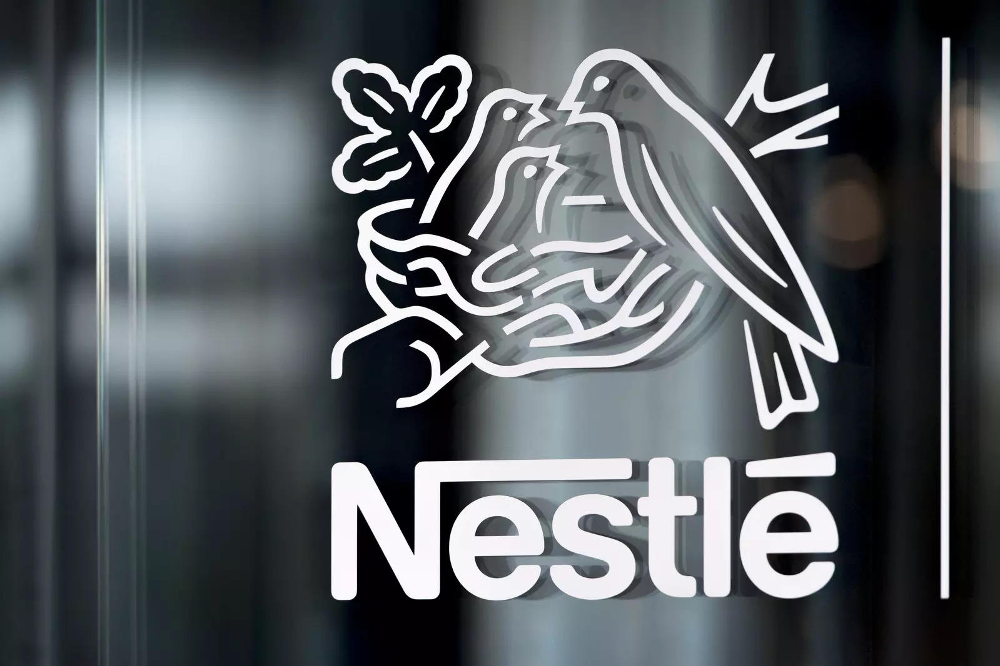
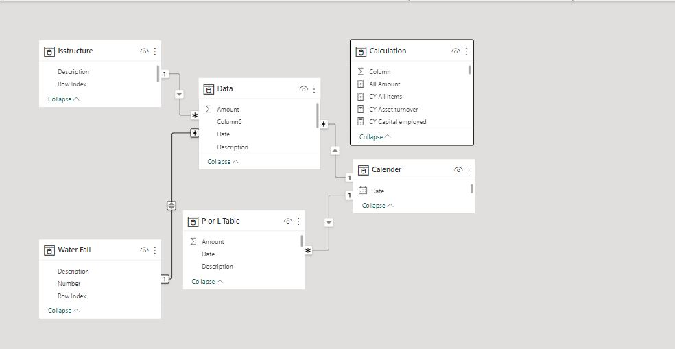
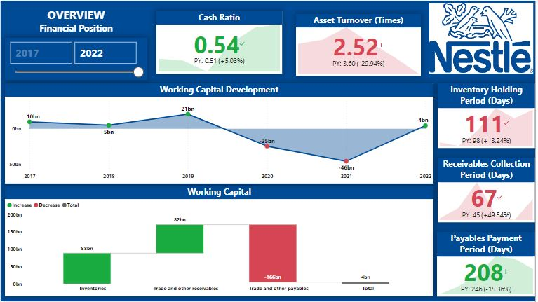

# Nestle Nig Plc Financial Position Analysis

## Introduction
Through an examination of **Nestle Nig Plc's** financial statement, particularly it statement of financial position, I evaluated the company's ability to meet its short-term obligations and identified important measures that can be taken to optimize liquidity management.

## Data Sourcing
The data was obtained from the website of the Nigerian Exchange Group (NGX). It was then subjected to data transformation using Excel before being loaded into power BI to facilitate visualization.

## Data Modelling
Relationships were clearly defined between tables that shared similar keys following a one to many cardinality. Additionally a one-way filter was applied to facilitate the appropriate data filtering and display between the tables.

## Analysis and Visuals

**The analysis of Nestle Nig Plc's statement of financial position reveals some important insights that can inform future decision-making:**
- The company's improved cash ratio of 0.54:1 in 2022 indicates that Nestle Nig plc has greater ability to cover its short-term obligations with its available cash and cash equivalents. This is a positive development, but the company may still need to consider ways to improve its cash flow management and ensure that it has sufficient liquidity to meet its obligations.

- The decline in asset turnover from 1.13 times in 2021 to 1.08 times in 2022 is a cause for concern, as it suggests that the company is becoming less efficient in using its assets to generate revenue. Given that the longer receivable collection period is largely responsible for this decline, Nestle Nig plc should explore ways to improve its accounts receivable management, such as offering incentives for early payment or reassessing its credit policies.

- Although Nestle Nig plc recorded a positive working capital in 2022, the report notes that this may be due to the fact that cash is tied up in inventory and receivables that have not been sold or collected. The company should consider implementing measures to reduce inventory holding periods and improve its receivables collection process. This could involve introducing better inventory management systems, negotiating more favorable payment terms with suppliers, and improving its communication with customers to ensure timely payment of invoices.

## Recommendation
**Based on these findings, it is recommended that Nestle Nig plc takes the following steps to improve its financial position:**
- Focus on improving cash flow management to ensure that the company has sufficient liquidity to meet its obligations. This could involve implementing more stringent payment terms with customers and suppliers, exploring new sources of funding, and reassessing its capital expenditure plans to ensure that they are aligned with the company's overall financial objectives.

- Develop a strategy to improve asset turnover, with a particular focus on accounts receivable management. This could involve introducing incentives for early payment, reassessing credit policies, and investing in more effective collection processes.

- Implement measures to reduce inventory holding periods and improve receivables collection. This could involve introducing better inventory management systems, negotiating more favorable payment terms with suppliers, and improving communication with customers to ensure timely payment of invoices.

**_By taking these steps, Nestle Nig plc can improve its financial position and position itself for long-term success._**
